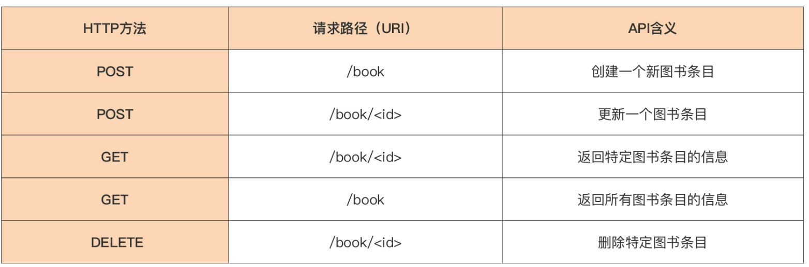

# demo01
## web.go
实现一个简单的web服务器跑起来,访问localhost:8080即可返回
# demo02
实现一个基本的增删改查图书管理系统

模块分析：
- 存储模块：store用来存储整个图书数据 针对图书的有限种管理操作，放置在一个接口类型Store中
```go
 type Book struct {
     Id      string   `json:"id"`      // 图书ISBN ID
     Name    string   `json:"name"`    // 图书名称
     Authors []string `json:"authors"` // 图书作者
     Press   string   `json:"press"`   // 出版社
 }
 
 type Store interface {
     Create(*Book) error        // 创建一个新图书条目
     Update(*Book) error        // 更新某图书条目
     Get(string) (Book, error)  // 获取某图书信息
     GetAll() ([]Book, error)   // 获取所有图书信息
     Delete(string) error       // 删除某图书条目
 }
```


